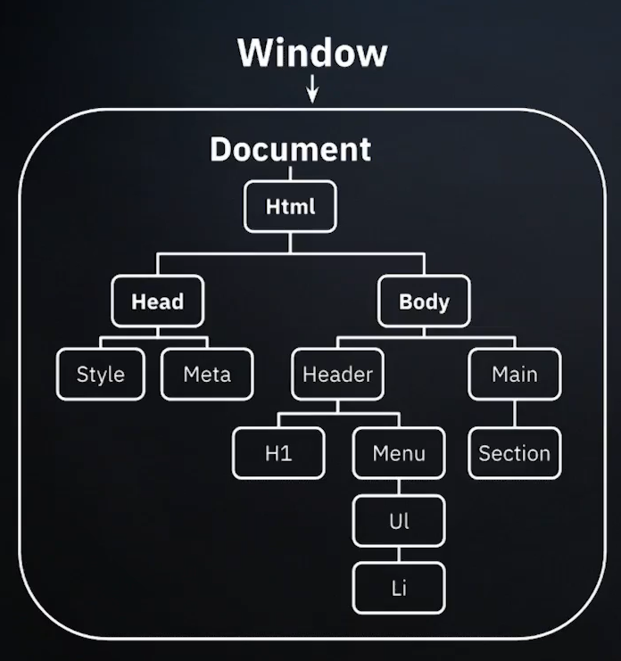

# DOCUMENT OBJECT MODEL
Es una interfaz de programacion HTML y XML. Representa la estructura de un arbol de nodos, donde cada nodo es un elemento del documento. Este modelo permite que js sea capaz de acceder y manipular el contenido, estructura y el estilo del documento de manera mas dinamica.
Es una interfaz de programacion HTML y XML. Representa la estructura de un arbol de nodos, donde cada nodo es un elemento del documento. Este modelo permite que js sea capaz de acceder y manipular el contenido, estructura y el estilo del documento de manera mas dinamica.


<div style="display: flex; gap: 10px;">
    
    <div>
        <h2>Window Object</h2>
        <p>Es el Objeto global en el entorno de ejecucion del navegador y actua como el contenedor global para las variables, funciones y objetos globales. Basicamente todas las variables se convierten en propiedades y metodos de "window"</p>
    </div>
</div>

## Traversing the DOM
Es el Proceso de navegar a traves de los elementos y sus relaciones en el DOM de un documento HTML. Esto permite acceder y modificar cualquier parte del contenido del documento.

### Metodos comunes
- Acceder al nodo padre:
``` javascript
    const child = document.querySelector('.child');
    const parent = child.parentNode;  
```

- Accede a todos los nodos hijos
``` javascript
    const parent = document.querySelector('.parent');
    const children = parent.childNodes;
```

- Acceder al primer y ultimo nodo hijo
``` javascript
    const first = parent.firstChild;
    const last = parent.lastChild
```

## Atributos HTML y propiedades JS
Los atributos HTML son valores adicionales que configuran elementos HTML o ajustan su comportamiento. En JavaScript, estos atributos HTML se representan como propiedades de los objetos del DOM, como value, id, name, etc. Es importante mencionar que los atributos son la representacion inicial del HTML, si nosotros lo modificamos mediante JS, esto no va a cambiar en el HTML, pero si en el DOM.
Cuando se accede a un elemento del DOM en JavaScript, sus atributos HTML se convierten automaticamente en propiedades del objeto correspondiente. Esto permite leer y modificar estos atributos de manera programatica.

### Ejemplos
- Acceder Y modificar el atributi 'src' de una imagen 
``` javascript
    const img = document.querySelector('img');
    console.log(img.src); // Muestra la URL actual
    img.src = 'nueva-imagen.jpg'; // Cambia la imagen
```
- Trabajar con el atributo "class"
``` javascript
    const div = document.querySelector('div');g
    console.log(div.className); // Muestra las clases actuales
    div.className += ' nueva-clase'; // Añade una nueva clase
```